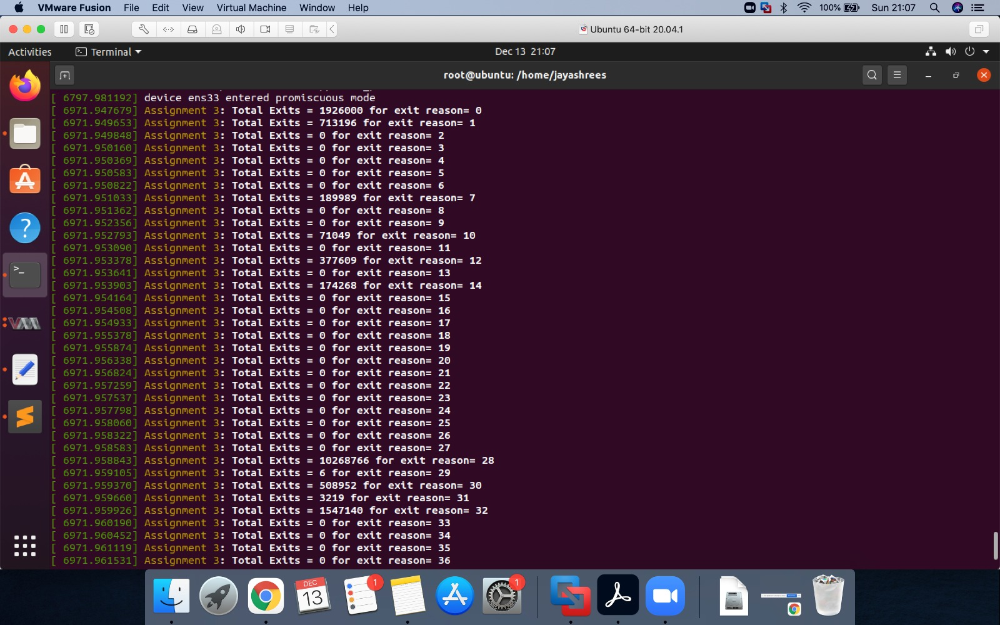
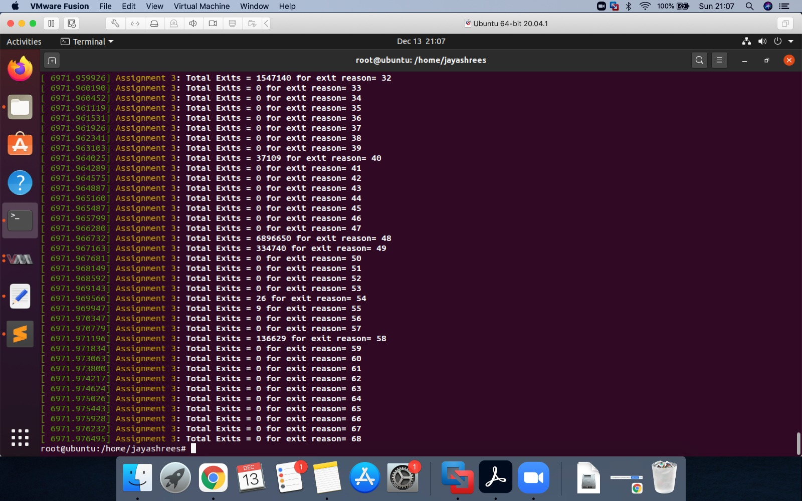
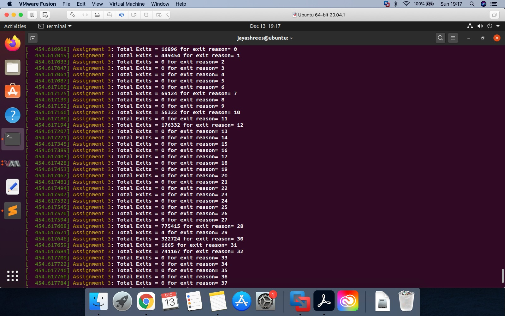
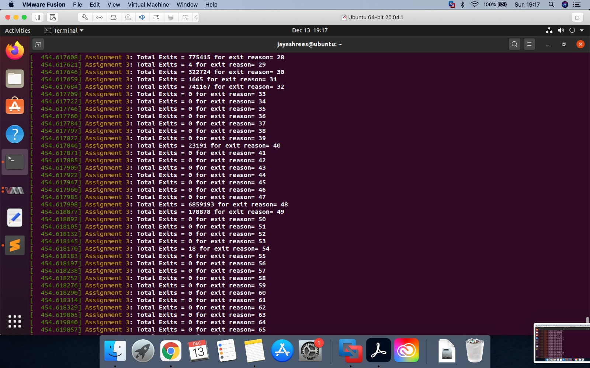
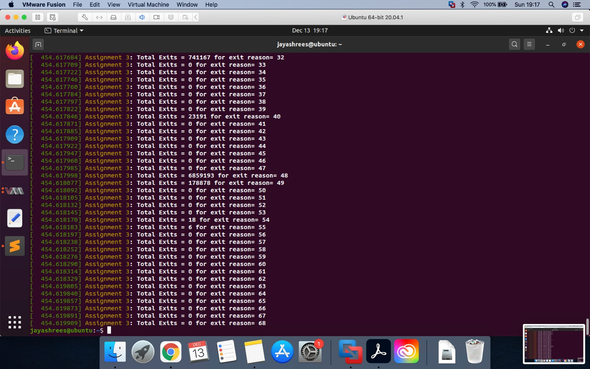

# CMPE283 Assignment 4

## Team Members

* **Jayashree Sridhar (014608581)**
* **Praneetha Sripada (014353664)**

### Q1 - Contribution by each member
> The contribution is combined for this assignment as it is not a coding assignment but an observation assignment of code written for Assignment 3
* **Jayashree Sridhar:** 
- Used setup configured for assignment 3 and launched outer and inner VMs
- Used test script written in assignment 3 for running in inner VM
- Executed test script for CPUID 0x4FFFFFFE for exit reasons 0 to 68 in ecx register for both ept and no ept scenarios
- Noted the changes in count of VM exits for with and without EPT scenarios

* **Praneetha Sripada:**  
- Used setup configured for assignment 3 and launched outer and inner VMs
- Used test script written in assignment 3 for running in inner VM
- Executed test script for CPUID 0x4FFFFFFE for exit reasons 0 to 68 in ecx register for both ept and no ept scenarios
- Noted the changes in count of VM exits for with and without EPT scenarios

  

### Q2 - Steps taken for assignment
- The configuration setup for assignment 3 was used for this assignment. ( https://github.com/jayashree-sridhar-16/linux/tree/master/Assignments/Assignment3#q2---steps)

###  Implementation
1. Boot inner VM with test code.
2. Once VM is booted, for CPUID leaf function 0x4FFFFFFE, record total exit count information (total count for each type of exit handled by KVM).
3. Shutdown your inner VM.
4. Remove the ‘kvm-intel’ module from running kernel.
```
rmmod kvm-intel
```

5. Reload the kvm-intel module with the parameter ept=0 to enable shadow paging
6. Module is found in /lib/modules/5.9.0+/kernel/arch/x86/kvm
```
uname -r 
> gives the version 5.9.0+
insmod /lib/modules/5.9.0+/kernel/arch/x86/kvm/kvm-intel.ko ept=0
```
7. Boot the same inner VM again, and capture the same output as you did in step 2.

## Questions/Answers/Observations

### Include a sample of your print of exit count output from dmesg from “with ept” and “without ept”.

- With ept

 
 

- Without ept

 
 
 


### What did you learn from the count of exits? Was the count what you expected? If not, why not?
- The count of VM exits was observed to be more for shadow paging (without ept) than nested paging (with ept). 
- A spike in VM exits was observed for the exit reasons  

| VM Exit reason | EPT | Without EPT| Description |  
| :----: | :----:| :----: | :----: |  
|0| 16896 | 1926000| #PF |
|28|775415 | 10268766 | Control register access/modification |
| 14 | 0 | 174268 | INVLPG |
| 58 | 0 | 136629| INVPCID|


- This is the expected behaviour since shadow paging implementation relies on VM exits like #PF (0), Control access exits, and INVLPG
- EPT mode implementation uses a secondary page table for hypervisor other than the page table used by guest, removing the need to have the above mentioned VM exits. EPT controls the last address translation to the host physical address.

### What changed between the two runs (ept vs no-ept)?
- With EPT mode, two layer page table is used for address translation. Guest VM does not exit for INVLPG instruction, Control register access/ modification or page fault exception. The guest VM owns the page table and hypervisor manages the second level page table for mapping the last address translation from guest physical address to host physical address.
- In shadow paging mode, VMM has to emulate any operation on CR3/0/4, page fault exceptions and INVLPG instruction, as Guest VM does not own the page table. Shadow paging uses these VM exits to create and flush page table entries inside the shadow (virtual) page table. Hence we notice lot of exits for #PF (0), control register accesses (28), and INVLPG related exits (14 and 58)

